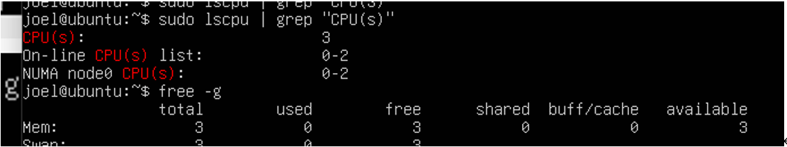

# Kn01
Das Hinzufügen von mehr Arbeitsspeicher als der Physikalische Client ist nicht möglich:
Der «OK» Balken wird ausgegraut angezeigt

Beim Einstellen des CPU wird bei der Vm VirtualBox Manager folgendes angezeigt:

Wieso kann man nicht mehr hinzufügen?
Das hinzufügen von Ram funktioniert nicht, da der Hypervisor direkt mit dem Localhost abgleicht und bemerkt, dass dieser selbst benötigt.
Bei der CPU wird dieser Virtuel verteilt.

# Titel1
## Titell 2
Hallo 
- 
-

