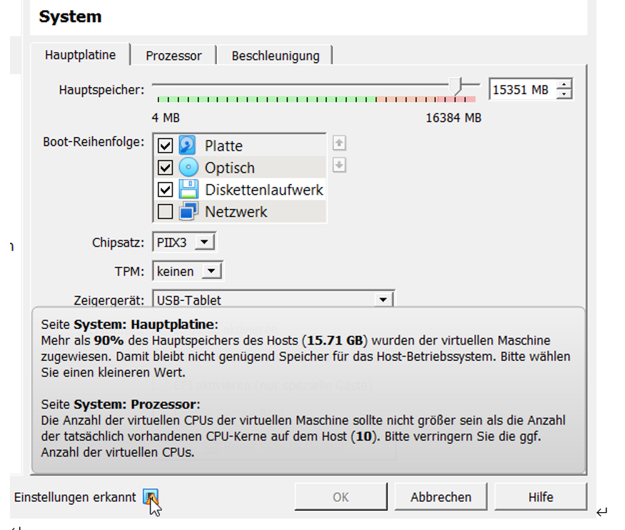
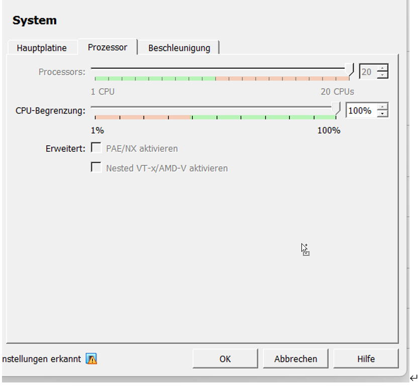

# Kn01 Virtualisierung

Das Hinzufügen von mehr Arbeitsspeicher als der Physikalische Client besitzt ist nicht möglich:
Der «OK» Balken wird ausgegraut angezeigt.

Beim Einstellen des CPU wird bei der Vm VirtualBox Manager folgendes angezeigt:

Das ändern des CPU funktioniert, jedoch steht die Fehlermeldung dass dies nicht empfehlenswert ist.

Wieso kann man nicht mehr hinzufügen?
Das hinzufügen von Ram funktioniert nicht, da der Hypervisor direkt mit dem Localhost abgleicht und bemerkt, dass dieser selbst benötigt.
Bei der CPU werden die Prozessoren Virtuel verteilt.

 

