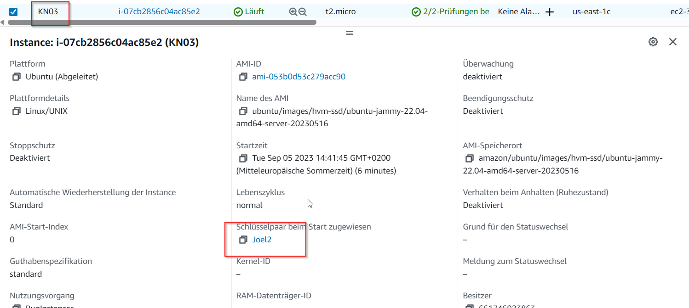
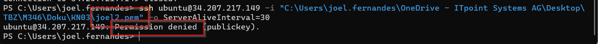
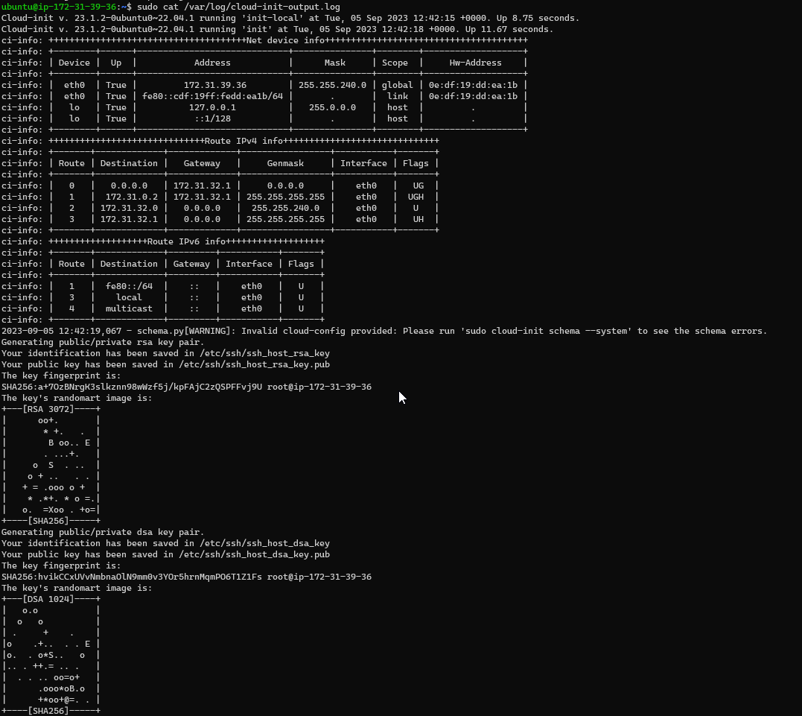
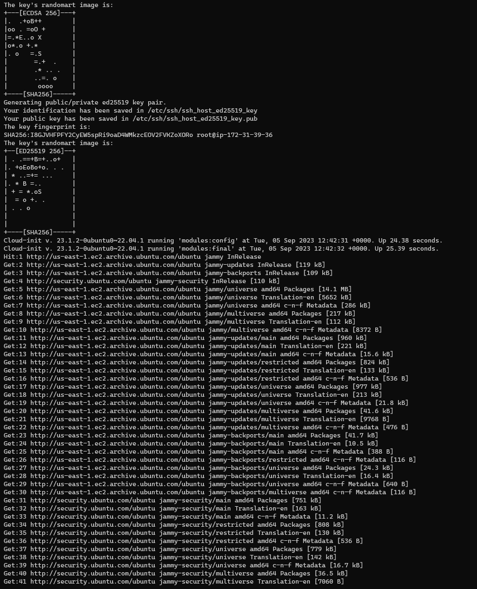
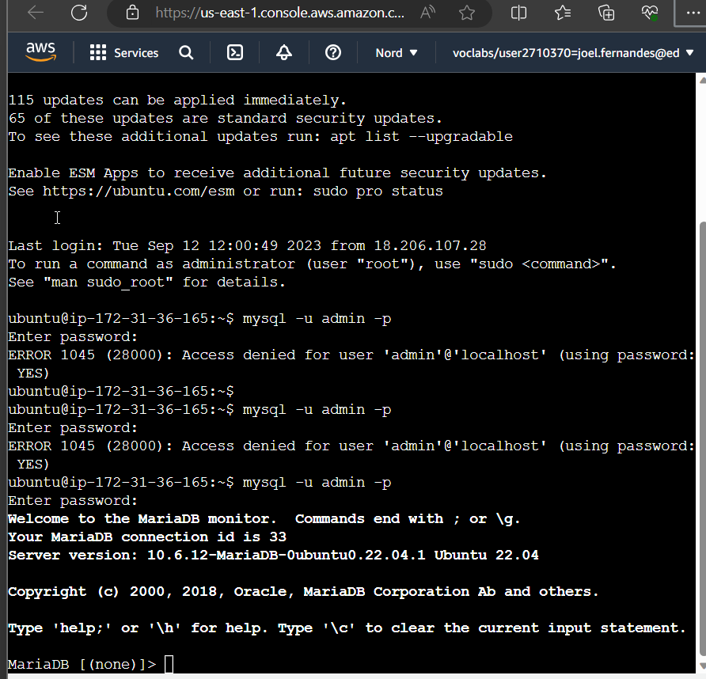
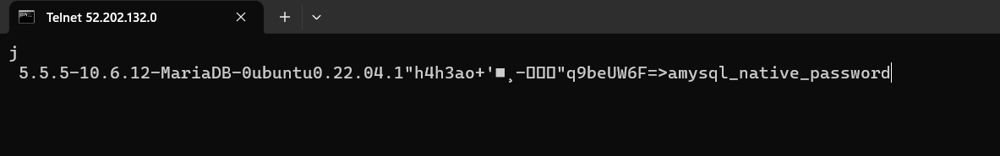
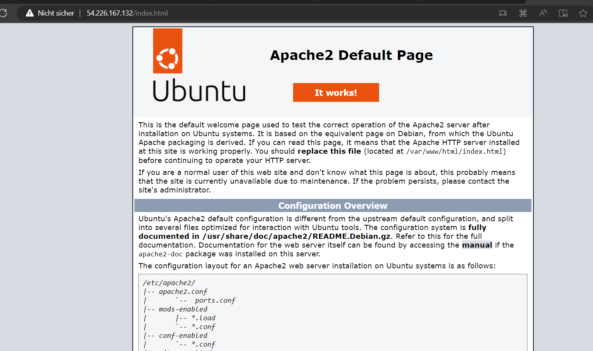
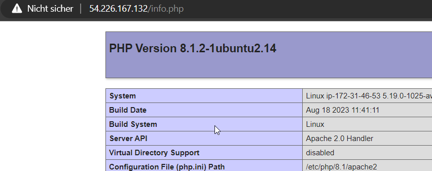
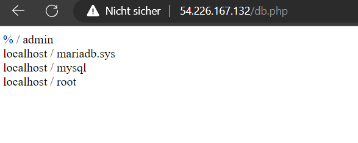
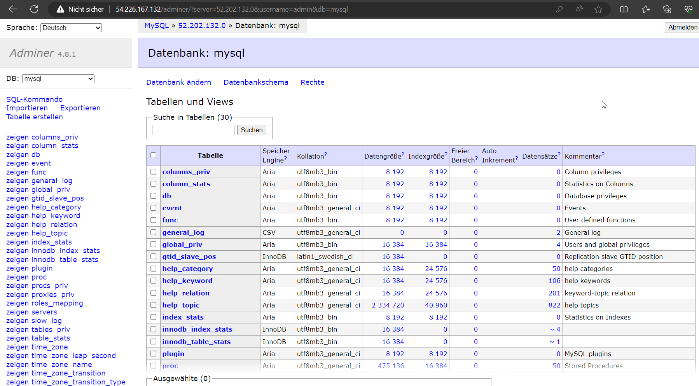

# KN03

## a) Cloud-Init Datei verstehen

## b) SSH-Key und Cloud-Init

Hier ist wieder der gleiche yaml, da ich direkt auf diesem geändert habe.

Hier sieht man wie es geklappt hat mit dem ersten Key

Hier sieht man den zweiten versuch mit dem Key der in der instanz angezeigt wird.

Hier sieht man die Logs.

##D) Auftrennung von Web- und Datenbankserver

