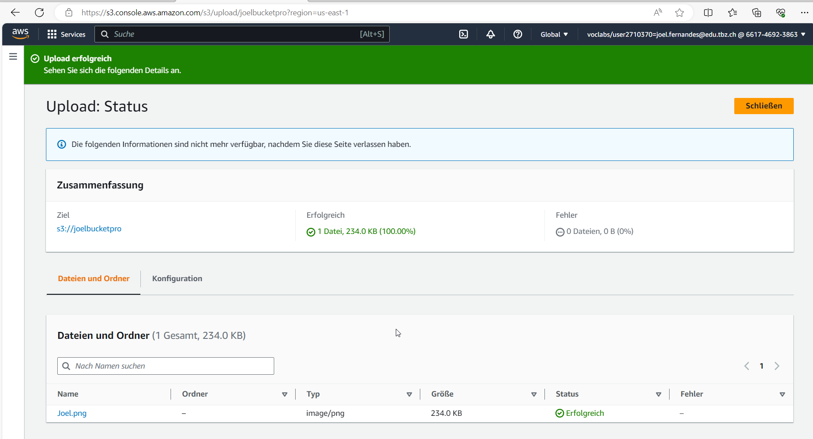
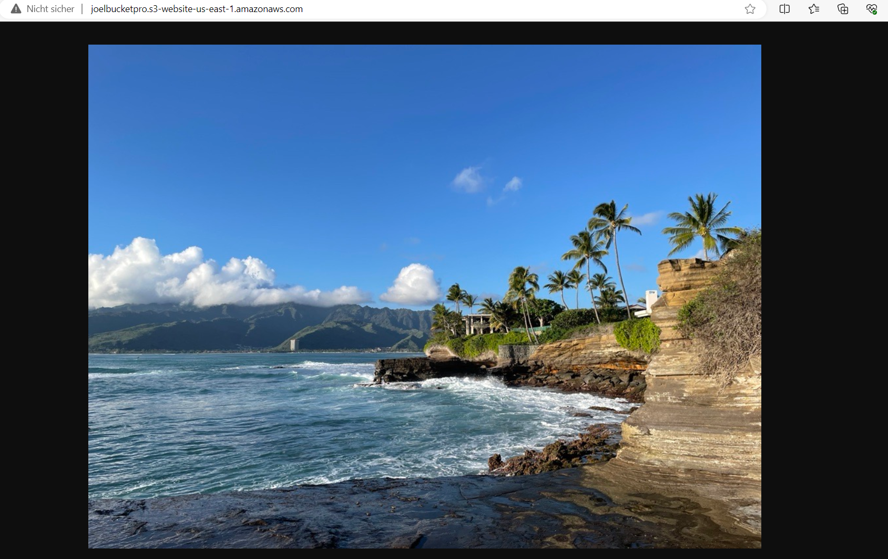
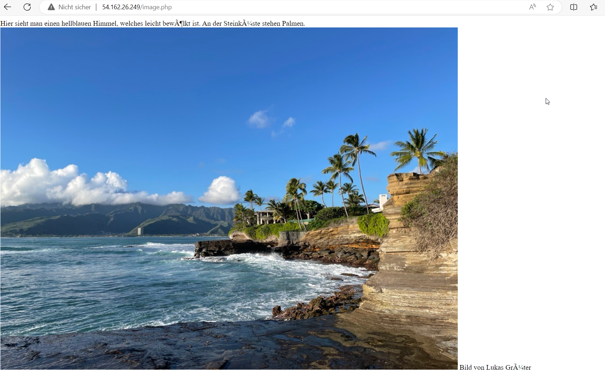
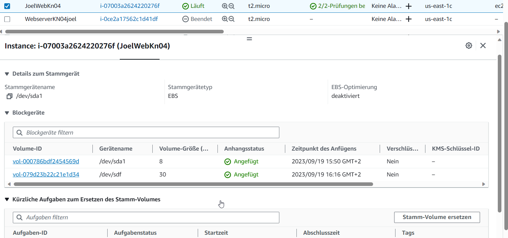

# KN04 

## A) Bild erstellen und auf S3 hosten

## B) Web-Server mit PHP-Seite hinzufügen

## C) Elastic Block Storage (EBS) hinzufügen.

## D) Speichereigenschaften erkennen

									Typ 							Persistenz
EBS Root 							hot								 nein
EBS Zusätzliches Volumen         	hot								 JA
S3 									warm  							 JA

Der EBS Root ist hot, da dieser direkt zugreifbar ist. Nicht persistent, da bei einem Unterbruch die Daten gelöscht werden.

EBS Zusätzliche Volumen sind warm, da sie auf dem server liegen. Dieser ist persitent, da bei einem unterbruch die Daten auf dem Volumen immernoch vorhanden sind.

S3 ist cold, da dieser nicht auf dem Server ist und nur abgerufen werden, wenn es benötigt wird. Bei Shutdown wird das Volumen nicht gelöscht.
