# A) Diagramm erstellen

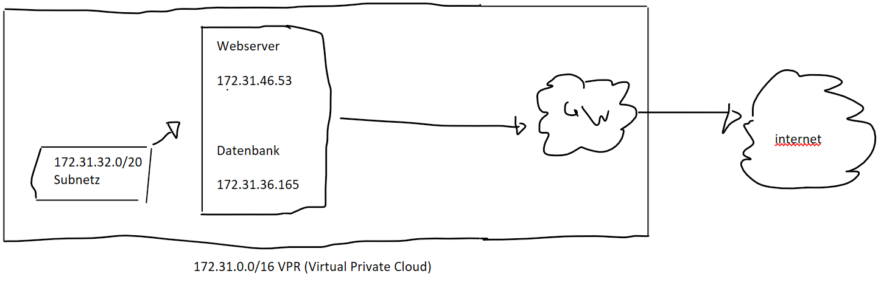

# B) Subnetz und private IP wählen
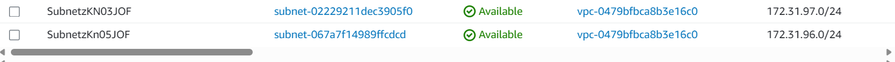

Web server IP : 172.31.96.20
Datenbank IP : 172.31.96.31

# C) Objekte und Instanzen erstellen

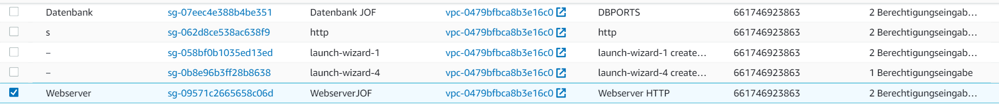

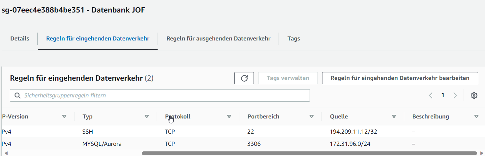

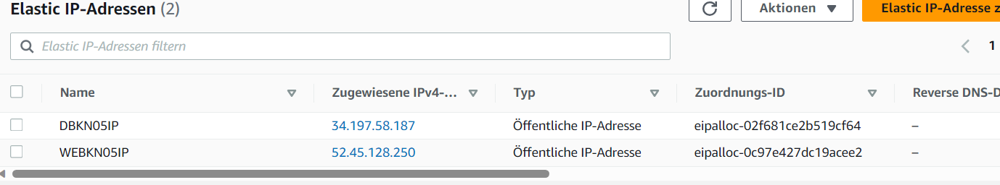

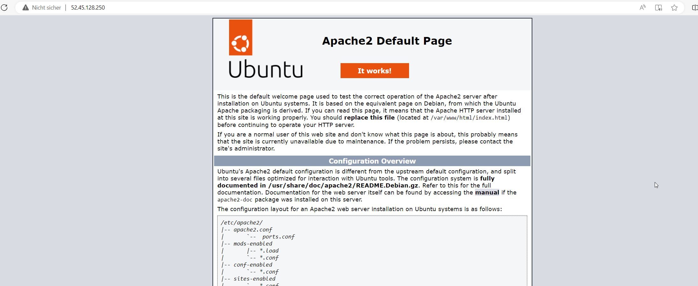
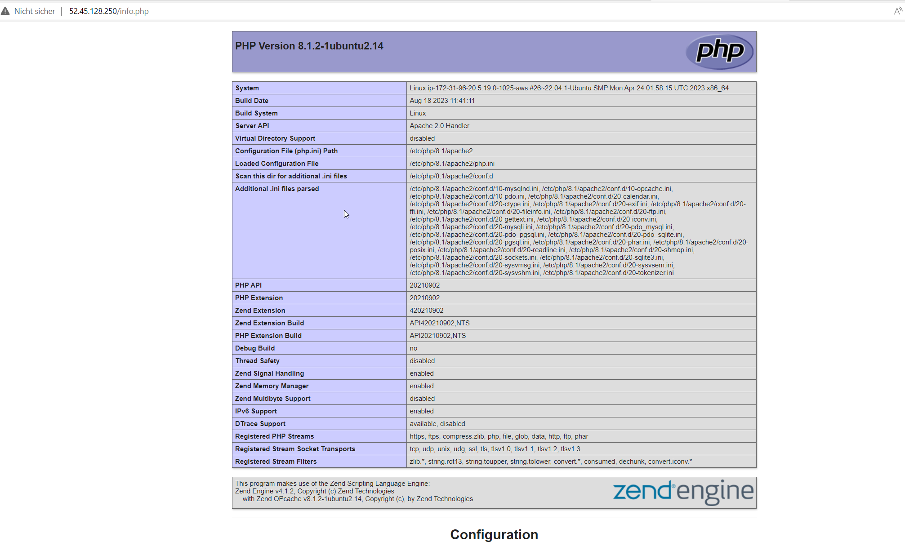
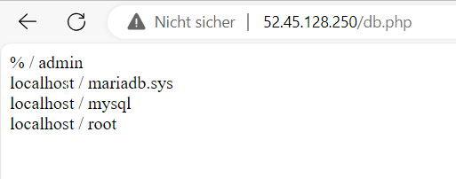

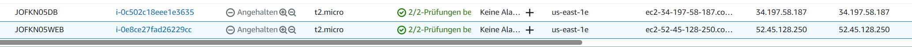

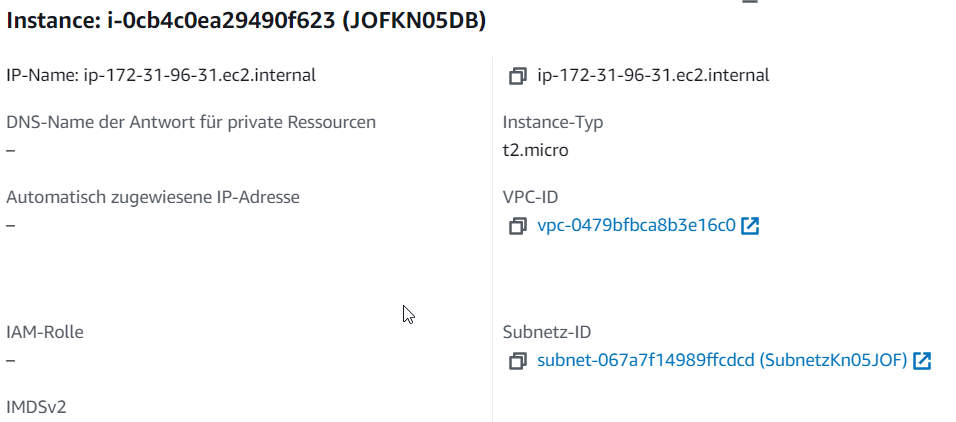
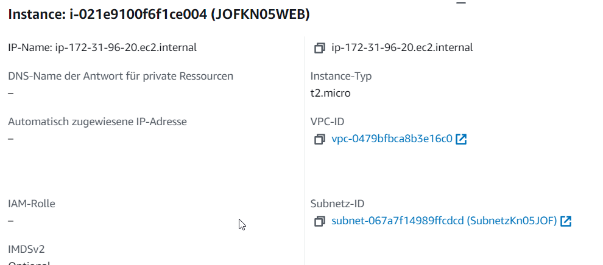

[WEBINIT File](WEBINIT.yaml)
