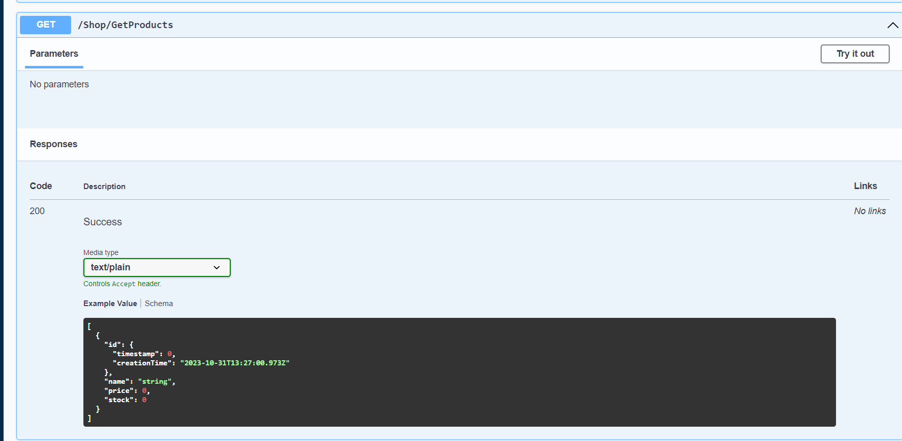
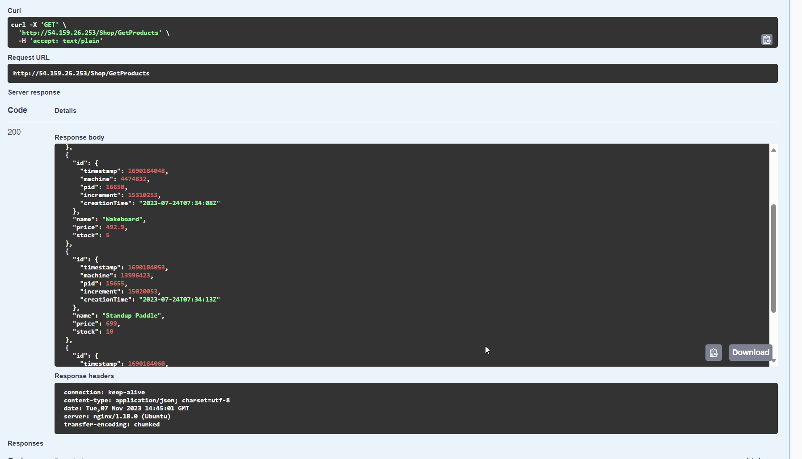

# A) Installation App

Ein Reverse Proxy ist eine Server oder Software welcher Client anfragen auf Backend Server vermittelt.

# B) Vertikale Skalierung

um den Typ zu ändern muss man die Instance herunterfahren.
Ich habe die Disk im AWS auf 28 GB erweitert, da mir ein Tippfehler unterlaufen ist. Die richtige Disk habe ich bei den Infos der Instance nachgeschaut.

# C) Horizontale Skalierung

Ein CName erstellen damit app.tbz-m346.ch auf die jetzige Swagger URL weitergeleitet wird.

# D) Auto Scaling
