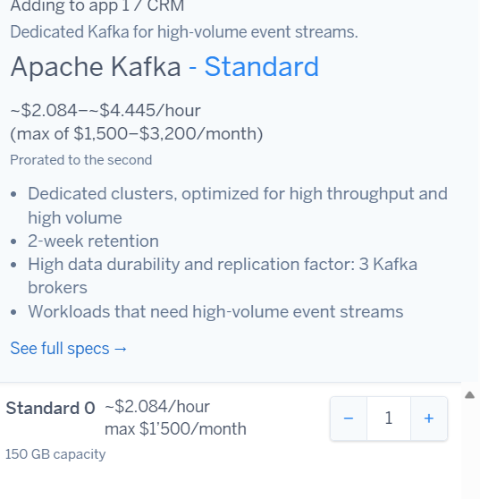
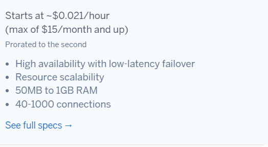
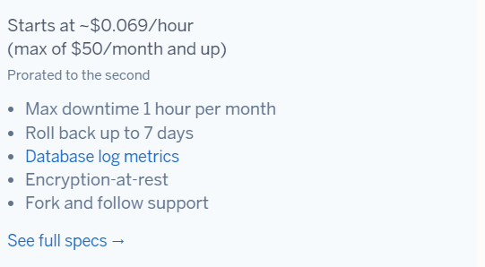
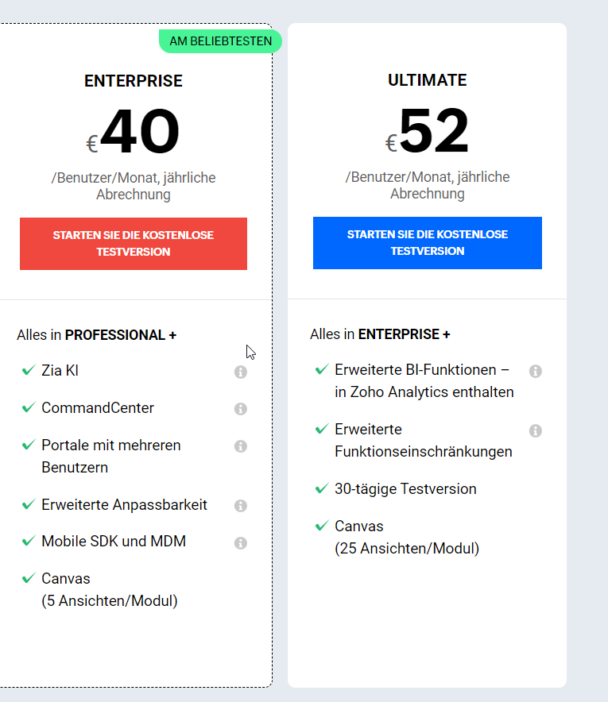
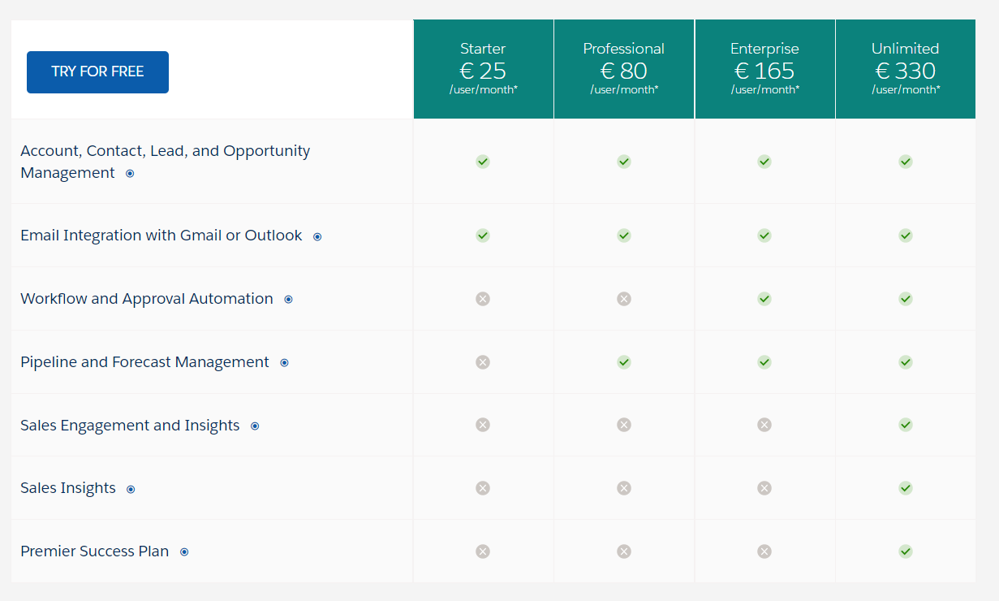

KN07

# 1) Rehosting
## AWS
		

## AZURE
	

Insgesamt ist Microsoft Azure Günstiger nach den Konfigurationen. Mann konnte jedoch kein Load Balincing in die Rechnung miteinbeziehn, dafür jedoch die Backups voranden, was bei AWS nicht zum Auswählen zur verfügung steht.
Aus meiner sicht würde ich Azure nehmen, da der fehlender Loadbalancer weniger wichtig ist als die Backups die gemacht werden müssen.

# 2) Replatforming
## Hegoku

Ich habe diese Services ausgewählt die möglichst nahe den Anforderungen liegen, damit die App für die Anforderungen lauft.
Die Advanced wäre keine Option, da diese die Kosten sprengen würde.
Backup ist vorhanden, genug grosse availabilty und genug RAM, da dies für nur 16 Mitarbeiter ist und auch für bis zu 50 Leuten reichen sollte. 

# 3) Repurchasing

Hier habe ich die Enterprise edition ausegwählt welches 640 pro monat kosten würde.

 

Hier würde ich die Enterprise edition auswählen dies würde im Monat 2640 EURO kosten.

Von diesen Beiden würde ich die Zoho Enterprise Edition auswählen, da sie von den Funktionen und dem Preis verhältnismässig sich in grenzen hält.

# B) Interpretation der Resultate

Wie stark unterscheiden sich die Angebote?
Die Angebote unterscheiden sich stark. Von 5000 USD und 2000 USD pro Monat oder 2640 Euro(Salesforce) oder 640 Euro (Zoho).

Gegenüberstellung der SaaS-Lösung zu IaaS und PaaS Lösungen von vorher. Welches wählen
Sie und wieso? Was müsste man zusätzlich beachten?

Ich würde die PaaS auswählen, da diese bei der Preisklasse im Mittelfeld liegt und von den Einschränkungen her diese noch überschaubar sind.
Wie viel das Replatforming für die Software benötigen würde und ob diese auch zukunftig von der Skalierbarkeit keine Probleme haben wird.

Wieso ist eines davon viel teurer? Ist es aber wirklich teurer?
Je nachdem kann eine Option mehr kosten je nachdem was für andere Aufwände auftreten können. Zumbeispiel das reshapen einer Software verursacht kosten. Das Skalieren in der Zukunft kann teurer werden bei einem Service oder möglicherweise fehlen noch andere Anforderungen die nicht im Angebot beinhaltet sind.
Schlussendlich ist es nur eine Einschätzung und kann somit varieren.
Je nachdem hat man mehr Flexibilität oder mehr Einschränkungen was sehr entscheidend sein kann bei der Auswahl, wenn das Tool nicht mehr richtig verwendet werden kann, verliert man schlussendlich ein Tool welches Probleme lösen sollte.

